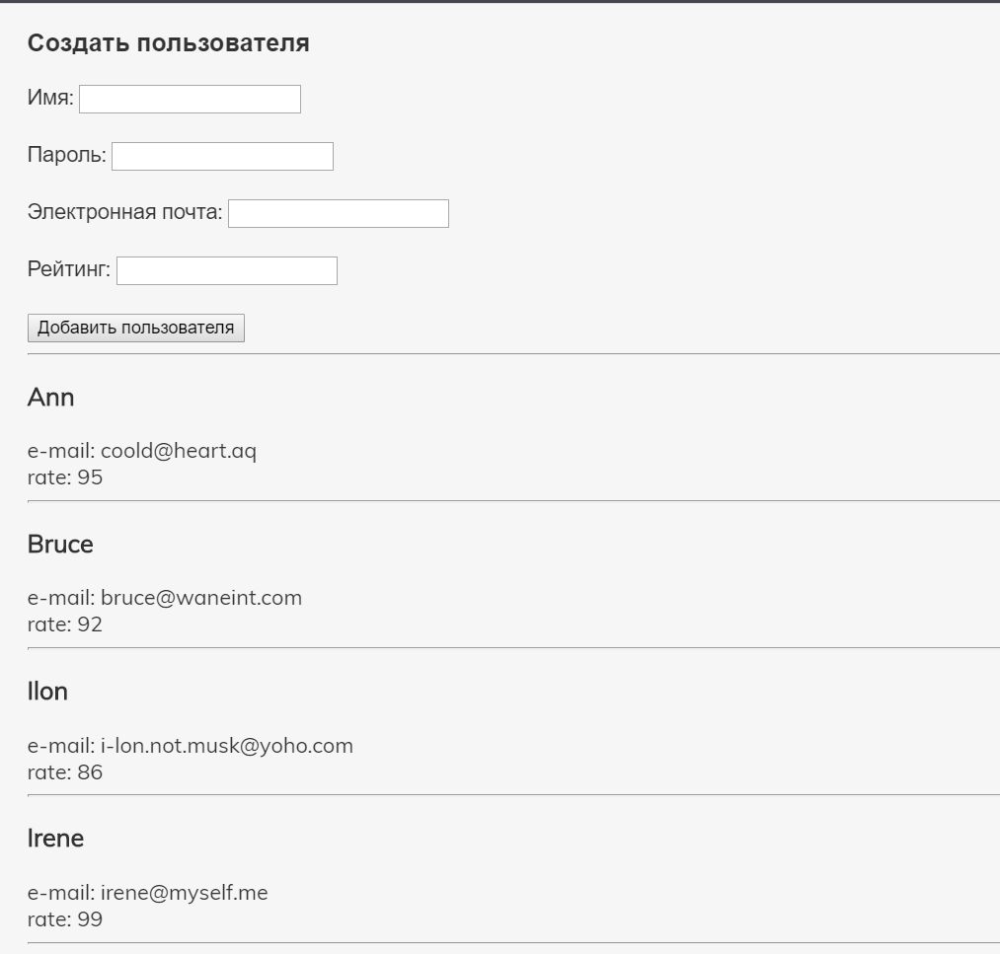

# Задание 2.2.2 - Модель доступа к данным

## Легенда
Работать с данными, которые находятся в файле не очень удобно. В связи с этим ваш коллега реализовал два класса:
- `JsonDataArray` - для работы с массивом данных, полученных из json-файла
- `DataRecordModel` - для работы с одной записью, хранящейся в массиве данных, полученных из json-файла

Вам требуется, используя эти классы, создать страницу отображения пользователей с формой добавления пользователей.

## Техническое задание
Требуется реализовать класс `User` (дочерний от DataRecordModel) и класс `Users` (дочерний от JsonDataArray)

`User`:
   -  Свойства:
      - `name` - public, string;
      - `email` - public, string;
      - `password` - public, string;
      - `rate` - public, int;
   -  Методы:
      - `addUserFromForm()` - public - добавление пользователя через форму;
   
`Users`:
   -  Методы:
      - `displaySortedList()` - public - вывод списка всех пользователей;
  
## Рекомендации по выполнению
**Cтруктура проекта:** 
- index.php
- autoload.php
- classes/DataRecordModel.php
- classes/JsonFileAccessModel.php
- classes/JsonObjDataModel.php
- classes/Singleton.php
- classes/User.php
- classes/Users.php
- formActions/addUser.php
- config/SystemConfig.php
- files/database/user.json

**В задании требуется:**
1. Используйте класс `JsonFileAccessModel`, созданный при выполнении первого задания.
2. Использовать файлы, приложенные к этому заданию:
   - [config/SystemConfig.php](config/SystemConfig.php),
   - [classes/Singleton.php](classes/Singleton.php), 
   - [classes/JsonDataArray.php](classes/JsonDataArray.php), 
   - [classes/DataRecordModel.php](classes/DataRecordModel.php),
   - [files/user.json](files/database/users.json).
3. Подключить файлы autoload.php и SystemConfig.php в начале файла index.php (именно в этом порядке)
4. В начале файла index.php должны быть подключены автозагрузка и настройки
5. Описать классы `User`, `Users`.
6. Описать метод `addUserFromForm` для класса `User` с добавлением пользователя и сохранением его в файл.
7. Описать метод `displaySortedList` для класса `Users`, возвращающий список пользователей без паролей (с помощью echo, с разметкой) в алфавитном порядке.
8. Описать на странице index.php вывод списка с помощью метода `displaySortedList` класса `User`.
9. Описать форму создания пользователя
10. Описать добавление пользователя с помощью метода `addUserFromForm` класса `User`.



**Дополнительная информация**

Для того, чтобы получить список пользователей, хранящийся в файле users.json, требуется:
```
$test = new Users;
$test->newQuery()->getObjs();
```
Если надо отсортировать список, при этом по полю `rate`, требуется изменить команду:
```
$test->newQuery()->orderBy('rate')->getObjs();
```
Для того, чтобы создать нового пользователя требуется: 
```
$test2 = new User;
```
Чтобы сохранить его:
```
$test2->commit();
```

**Структура экшена (_action_) формы добавления пользователя (`formActions/addUser.php`):**
```php
<?php
/*Подключение необходимых файлов*/

/*Создание объекта*/

/*Передача значений свойств из формы в объект*/

/*Сохранение*/

/*Далее перенаправление на страницу, с которой производилась отправка формы:*/
header('HTTP/1.1 200 OK'); 
header('Location: http://' . $_SERVER['HTTP_HOST'] . '/2.2-OOP/2.2.2');
```

## Дополнительно, по желанию
Добавить возможность удаления пользователей.
