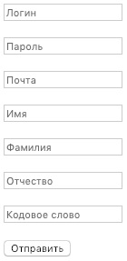

# Задача 1. Регистрация

#### В рамках домашнего задания к лекции «Формы и строки»

## Описание
Для интернет-магазина нужно создать форму регистрации со следующими полями:
- Логин
- Пароль
- Почта
- Имя
- Фамилия
- Отчество
- Почта
- Captcha (проверка, что вы не робот)

## Техническое задание
Для того, чтобы была возможность коммуникации с клиентом,
необхоимо быть уверенными, что пользователь ввел все данные корректно
1. Пользователь не должен иметь возможность вводить в поле логин спецсимволы (@/\*?,;:)
2. Пароль должен быть длинной минимум 8 символов
3. Почта должна быть формата `почта@домен.доменнаязона`
4. Поля Фамилия, Имя, Отчество не могут быть пустыми
5. Captcha должна совпадать с заранее объявленной. Captch'у нужно объявить заранее строкой произвольной длины. 
Например `nd82jaake`

Если пользователь, который вводит данные, не соблюдал условия, то 
нужно вывести сообщение об ошибке (использовать просто функцию `echo`).

Если же пользователь все ввел верно, то нужно вывести сообщение об успешной регистрации.

## Пример

Пользователь ввел следующие данные:
- Логин: `Alexandr`
- Пароль: `l1j9v`
- Почта: `somemail@email.com`
- Имя: `Иван`
- Фамилия: `Иванов`
- Отчество: `Иванович`
- Captcha: `nd82jaake`

Пароль введен слишком короткий, поэтому пользователь получит следующее сообщение на экран:
> Длина пароля должна быть минимум 8 символов

## Дополнительно
Вывести сообщение об ошибке на экран по всем полям сразу

Например:

Пользователь неверно заполнили поля `Логин, Пароль, Имя`, в таком случае он должен увидеть сообщение:
> Поле логин не должно содержать символы @/\*?,;:. \
> Длина пароля должна быть минимум 8 символов \
> Имя обязательно к заполнению
